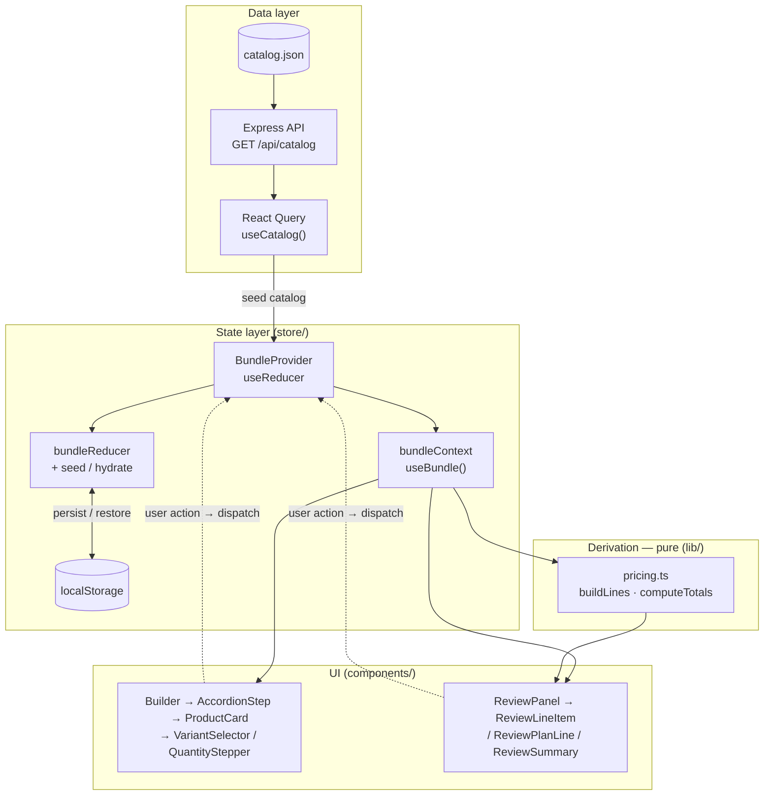

# Bundle Builder

A multi-step security-system bundle builder with a live review panel, built as a
data-driven React prototype. The left column is a 4-step accordion for assembling a
system; the right column is a live summary that recalculates as selections change.

## How it works (the business flow)

The product goal is conversion: guide the shopper to assemble a multi-product
**bundle**, and at every step surface the value signals — savings vs. the
compare-at price, monthly financing, free shipping, and the satisfaction
guarantee — that nudge them to check out. If they're not ready, they can save and
come back to exactly where they left off.


## Tech stack

- **React 18 + TypeScript + Vite**
- **Tailwind CSS** for styling (design tokens pulled from the Figma variables)
- **TanStack Query (React Query)** for fetching the catalog
- **Express** — a tiny backend that serves the catalog JSON (the optional bonus)
- **localStorage** for persistence
- **lucide-react** for icons

## Run it (from a clean clone)

```bash
npm install
npm run dev
```

`npm run dev` starts **both** the API server (`http://localhost:3001`) and the Vite
dev server (`http://localhost:5173`) together. Open **http://localhost:5173**.

> Vite proxies `/api/*` to the Express server, so you only ever visit the Vite URL.

### Other scripts

| Script | What it does |
| --- | --- |
| `npm run dev` | Run API + web together (recommended) |
| `npm run dev:web` | Vite dev server only |
| `npm run dev:server` | Express API only |
| `npm run build` | Type-check, then build to `dist/` |
| `npm start` | Run the API **and** serve the built `dist/` from one process (run `npm run build` first) → http://localhost:3001 |
| `npm run lint` | ESLint (TypeScript + React Hooks rules) |
| `npm run typecheck` | `tsc --noEmit` |
| `npm test` | Vitest unit/integration suite (run once) |
| `npm run test:watch` | Vitest in watch mode |

## How it's structured

### Architecture (technical)

Unidirectional data flow. The catalog is fetched once and seeded into a reducer;
every interaction dispatches an action that produces new immutable selection state,
which is (a) persisted to `localStorage` and (b) fed through **pure** derivation
functions to recompute totals — so the card steppers, the "N selected" counters,
and the review panel all stay in sync from one source of truth.



```
server/
  catalog.json        # single source of truth for products, prices, copy
  index.js            # GET /api/catalog (+ serves dist/ in production)
src/
  hooks/useCatalog.ts # React Query fetch of the catalog
  store/
    bundleState.ts    # reducer, seed, hydrate, localStorage helpers
    bundleContext.ts  # context object + useBundle hook
    BundleProvider.tsx# provider wiring state + actions to the context
  lib/
    pricing.ts        # pure derivations: lines, per-step counts, totals
    format.ts         # currency formatting
    cn.ts             # clsx + tailwind-merge class composer
  components/
    builder/          # accordion, product cards, variant selector
    review/           # review panel, line items, totals, checkout
    ui/               # QuantityStepper, Price, StepIcon
  assets/icons/       # step + caret SVGs, imported as components via svgr
  test/fixtures.ts    # shared catalog fixture for the unit tests
```

### Data-driven

Everything renders from `server/catalog.json`. Each step lists its products, and
each product carries its pricing, optional badge, optional variants, and a `seed`
block describing the initial quantities/active variant. The seed is what makes the
app load looking like the design (Cam v4 ×1, Cam Pan v3 ×2, the pre-selected
sensors, accessory, and plan). Adding a product is a JSON edit — no new markup.

### State & the variant model

Selection state is kept per product as `{ activeVariantId, quantities }`, where
`quantities` is keyed by **variant id** (or `_default` for products with no colors):

- Each color tracks **its own quantity**. Red and Blue of the same product are
  independent counts.
- The card's stepper is bound to the **active** variant; selecting a color shows
  and edits that variant's count.
- The review panel renders **one line per variant with qty > 0**, so adding 2 Red
  then switching the card to Blue leaves the Red (×2) line untouched on the right.
- Card and review steppers are the same underlying state, so they stay in sync and
  the total recalculates live.

This exact behavior is covered by `src/store/variantFlow.test.ts` (see Tests).

### Persistence — "Save my system for later"

Selections are persisted to `localStorage` (`bundle-builder:v1`) so a reload or a
return visit restores the system exactly as it was left. The **Save my system for
later** link also writes explicitly and shows a confirmation. On load the saved
state is merged onto a fresh seed, so newly added catalog products still appear.

## Responsiveness

- **≥1024px** — two columns; the review panel is sticky beside the builder.
- **640–1024px** — builder full width with a 2-up card grid; review below.
- **<640px** — single column, stacked, full-width cards.

Stays usable down to ~390px with no horizontal overflow.

## Tests

A **Vitest** suite (27 tests, `npm test`) covers the logic the UI depends on:

- `lib/pricing.test.ts` — variant-key resolution, per-variant quantities, line
  building, category ordering, and `computeTotals` (one-time vs. monthly plan split,
  savings from compare-at prices, free shipping, financing).
- `store/bundleState.test.ts` — the reducer (increment, min-clamped decrement,
  non-negative `setQuantity`, variant switch), seed/hydrate merging, and
  localStorage persistence including rejection of malformed/invalid payloads.
- `store/variantFlow.test.ts` — an end-to-end check of the brief's key requirement:
  add 2 White → switch to Black (stepper reads 0, White untouched) → add 1 Black →
  the review lists both variants as separate lines.
- `lib/format.test.ts` — currency formatting.

`lint`, `typecheck`, `test`, and `build` run on every push/PR via GitHub Actions
(`.github/workflows/ci.yml`).

## Decisions & tradeoffs

- **Pricing is consistent unit × quantity.** The Figma's hand-placed dollar amounts
  aren't internally consistent (e.g. the review's Cam Pan v3 line isn't 2× its card
  unit price, and the mock total/savings don't sum from the line items). Rather than
  hard-code the mock figures, the app treats each product's unit price as the source
  of truth and computes line totals, the grand total, savings, and financing from
  it — so everything recalculates correctly as quantities change. The seeded total
  therefore reads **$199.88 / save $47.92** instead of the mock's static
  $187.89 / $50.92. Behavior over a static snapshot.
- **Typography: Poppins instead of Gilroy.** The Figma uses **Gilroy**
  (`Gilroy-SemiBold/Medium/Regular`), a commercial font that can't be legally
  bundled. **Poppins** (Google Fonts) is a close free geometric substitute and is
  wired up as the default. If you have a Gilroy license, drop the font files in —
  it's already first in the `fontFamily` stack in `tailwind.config.js`, so no other
  change is needed. Exact sizes/weights/colors were matched to the Figma spec
  (title 16/600 `#1f1f1f`, body 12/500 `#1f1f1f`@75%, card price 16/400 with a red
  compare and `#575757` active).
- **Product images** live in `public/images` and are referenced by path from the
  catalog, so the app is fully self-contained and offline-friendly. Swapping assets
  is just replacing the files — the paths already live in the catalog, no code change.
- **Backend bonus, kept tiny.** The Express server just serves `catalog.json` (and
  the built SPA in production). A local JSON import would also satisfy the brief;
  the API demonstrates the React Query data flow.
- **Client state with Context + useReducer** rather than a state library — the state
  is small and this keeps dependencies minimal while staying testable (`pricing.ts`
  is pure).
- **Variant chip selection styling is intentionally light-touch**, per the brief,
  which asked to focus on the selection/quantity behavior over chip highlighting.
- **Plan & shipping rows** in the review have no stepper, matching the design (they
  aren't quantity-driven add controls in this view).
- **Icons are a presentation concern, not data.** The catalog JSON carries no
  `icon` field — a real product API wouldn't dictate which glyph the UI draws. Step
  icons are resolved from the step's domain `id` in `StepIcon`, and the SVGs live in
  `src/assets/icons/` imported as themeable (`currentColor`) React components via
  `vite-plugin-svgr`, rather than pasted inline in components.
- **Currency comes from the catalog.** Prices are formatted with `Intl.NumberFormat`
  bound to `catalog.currency`, exposed as `formatPrice` on the bundle context, so the
  declared currency is actually honored instead of a hardcoded `$`.

## What I'd do next

- Real product imagery and the Figma's exact brand font.
- A tiny toast system for checkout instead of the inline confirmation.
- Component/DOM tests (Testing Library) on top of the existing Vitest suite.
