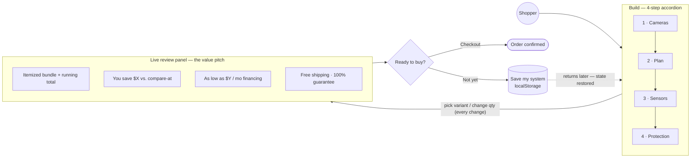
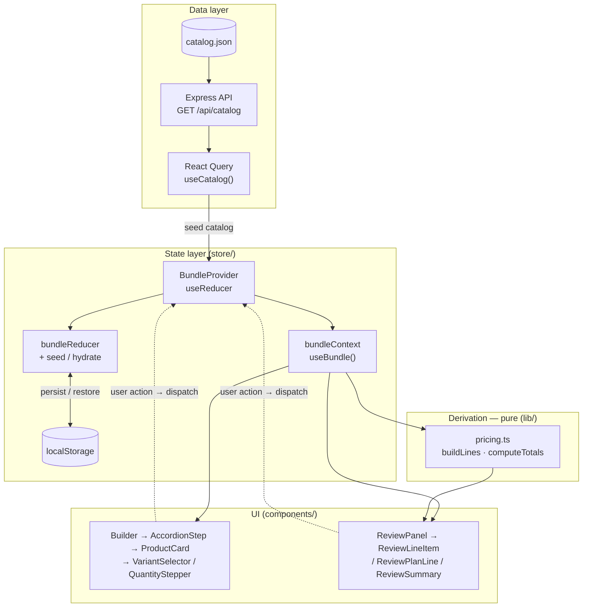

# Bundle Builder

> A multi-step security-system bundle builder with a live review panel — a data-driven React prototype where shoppers assemble a system in a 4-step accordion and see totals update in real time.

<p align="center">
  <a href="https://github.com/abdallahmoustafa94/bundle-builder/actions/workflows/ci.yml"></a>
  
  
  
  
  
</p>

---

## Table of contents

| | |
| --- | --- |
| [Business flow](#business-flow) | [Getting started](#getting-started) |
| [Tech stack](#tech-stack) | [Project structure](#project-structure) |
| [Architecture](#architecture) | [Key concepts](#key-concepts) |
| [Responsive layout](#responsive-layout) | [Testing & CI](#testing--ci) |
| [Design decisions](#design-decisions) | [Roadmap](#roadmap) |

---

## Business flow

The product goal is conversion: guide the shopper to assemble a multi-product **bundle**, and at every step surface the value signals — savings vs. the compare-at price, monthly financing, free shipping, and the satisfaction guarantee — that nudge them to check out. If they're not ready, they can save and come back to exactly where they left off.



---

## Tech stack

<p align="center">
  
  
  
  
  
</p>

| Layer | Choice |
| --- | --- |
| **UI** | React 18, TypeScript, Tailwind CSS (tokens from Figma variables) |
| **Data fetching** | TanStack Query (`useCatalog`) |
| **State** | Context + `useReducer`, persisted to `localStorage` |
| **Backend** | Express — serves `catalog.json` (optional bonus) |
| **Build** | Vite + SVGR for themeable step icons |

---

## Getting started

**Prerequisites:** Node.js 20 and npm 10.

```bash
git clone git@github.com:abdallahmoustafa94/bundle-builder.git
cd bundle-builder
npm install
npm run dev
```

`npm run dev` starts **both** the API server (`http://localhost:3001`) and the Vite dev server (`http://localhost:5173`) together. Open **http://localhost:5173**.

> Vite proxies `/api/*` to the Express server, so you only ever visit the Vite URL.

### Scripts

| Script | Description |
| --- | --- |
| `npm run dev` | Run API + web together *(recommended)* |
| `npm run dev:web` | Vite dev server only |
| `npm run dev:server` | Express API only |
| `npm run build` | Type-check, then build to `dist/` |
| `npm start` | Serve API + built `dist/` from one process *(run `build` first)* → http://localhost:3001 |
| `npm run lint` | ESLint (TypeScript + React Hooks rules) |
| `npm run typecheck` | `tsc --noEmit` |
| `npm test` | Vitest suite (27 tests, run once) |
| `npm run test:watch` | Vitest in watch mode |

---

## Project structure

```
server/
  catalog.json        # single source of truth for products, prices, copy
  index.js            # GET /api/catalog (+ serves dist/ in production)
src/
  hooks/useCatalog.ts # React Query fetch of the catalog
  store/
    bundleState.ts    # reducer, seed, hydrate, localStorage helpers
    bundleContext.ts  # context object + useBundle hook
    BundleProvider.tsx# provider wiring state + actions to the context
  lib/
    pricing.ts        # pure derivations: lines, per-step counts, totals
    format.ts         # currency formatting
    cn.ts             # clsx + tailwind-merge class composer
  components/
    builder/          # accordion, product cards, variant selector
    review/           # review panel, line items, totals, checkout
    ui/               # QuantityStepper, Price, StepIcon
  assets/icons/       # step + caret SVGs, imported as components via svgr
  test/fixtures.ts    # shared catalog fixture for the unit tests
```

---

## Architecture

Unidirectional data flow. The catalog is fetched once and seeded into a reducer; every interaction dispatches an action that produces new immutable selection state, which is (a) persisted to `localStorage` and (b) fed through **pure** derivation functions to recompute totals — so the card steppers, the "N selected" counters, and the review panel all stay in sync from one source of truth.



---

## Key concepts

### Data-driven catalog

Everything renders from `server/catalog.json`. Each step lists its products, and each product carries its pricing, optional badge, optional variants, and a `seed` block describing the initial quantities/active variant. The seed is what makes the app load looking like the design (Cam v4 ×1, Cam Pan v3 ×2, the pre-selected sensors, accessory, and plan). Adding a product is a JSON edit — no new markup.

### State & the variant model

Selection state is kept per product as `{ activeVariantId, quantities }`, where `quantities` is keyed by **variant id** (or `_default` for products with no colors):

- Each color tracks **its own quantity**. Red and Blue of the same product are independent counts.
- The card's stepper is bound to the **active** variant; selecting a color shows and edits that variant's count.
- The review panel renders **one line per variant with qty > 0**, so adding 2 Red then switching the card to Blue leaves the Red (×2) line untouched on the right.
- Card and review steppers are the same underlying state, so they stay in sync and the total recalculates live.

This exact behavior is covered by `src/store/variantFlow.test.ts` (see [Testing & CI](#testing--ci)).

### Persistence — "Save my system for later"

Selections are persisted to `localStorage` (`bundle-builder:v1`) so a reload or a return visit restores the system exactly as it was left. The **Save my system for later** link also writes explicitly and shows a confirmation. On load the saved state is merged onto a fresh seed, so newly added catalog products still appear.

---

## Responsive layout

| Breakpoint | Layout |
| --- | --- |
| **≥ 1024px** | Two columns; review panel sticky beside the builder |
| **640 – 1024px** | Builder full width with 2-up card grid; review below |
| **< 640px** | Single column, stacked, full-width cards |

Stays usable down to ~390px with no horizontal overflow.

---

## Testing & CI

A **Vitest** suite (27 tests, `npm test`) covers the logic the UI depends on:

| File | Coverage |
| --- | --- |
| `lib/pricing.test.ts` | Variant-key resolution, per-variant quantities, line building, category ordering, `computeTotals` (one-time vs. monthly plan split, savings, shipping, financing) |
| `store/bundleState.test.ts` | Reducer actions, seed/hydrate merging, localStorage persistence, malformed payload rejection |
| `store/variantFlow.test.ts` | End-to-end variant flow: add 2 White → switch to Black → add 1 Black → both lines in review |
| `lib/format.test.ts` | Currency formatting |

`lint`, `typecheck`, `test`, and `build` run on every push/PR via [GitHub Actions](.github/workflows/ci.yml).

---

## Design decisions

| Topic | Decision |
| --- | --- |
| **Pricing** | Unit price × quantity is the source of truth. Figma mock totals don't sum from line items, so the app derives totals dynamically. Seeded total: **$199.88 / save $47.92** (vs. mock's static $187.89 / $50.92). |
| **Typography** | **Poppins** (Google Fonts) substitutes for commercial **Gilroy**. Already first in the `fontFamily` stack — swap in licensed Gilroy files with no other change. |
| **Product images** | Live in `public/images`, referenced by path from the catalog. Self-contained and offline-friendly. |
| **Backend** | Tiny Express API serving `catalog.json` (+ built SPA in production). Demonstrates React Query data flow; a local JSON import would also satisfy the brief. |
| **State management** | Context + `useReducer` — small surface, minimal dependencies, testable pure derivations in `pricing.ts`. |
| **Variant chips** | Light-touch styling per brief — focus on selection/quantity behavior over chip highlighting. |
| **Plan & shipping rows** | No stepper in review, matching the design. |
| **Icons** | Presentation concern, not data. Step icons resolve from step `id` via `StepIcon`; SVGs in `src/assets/icons/` imported through `vite-plugin-svgr`. |
| **Currency** | `Intl.NumberFormat` bound to `catalog.currency` via `formatPrice` on the bundle context. |

---

## Roadmap

- Real product imagery and the Figma's exact brand font
- A toast system for checkout instead of the inline confirmation
- Component/DOM tests (Testing Library) on top of the existing Vitest suite
